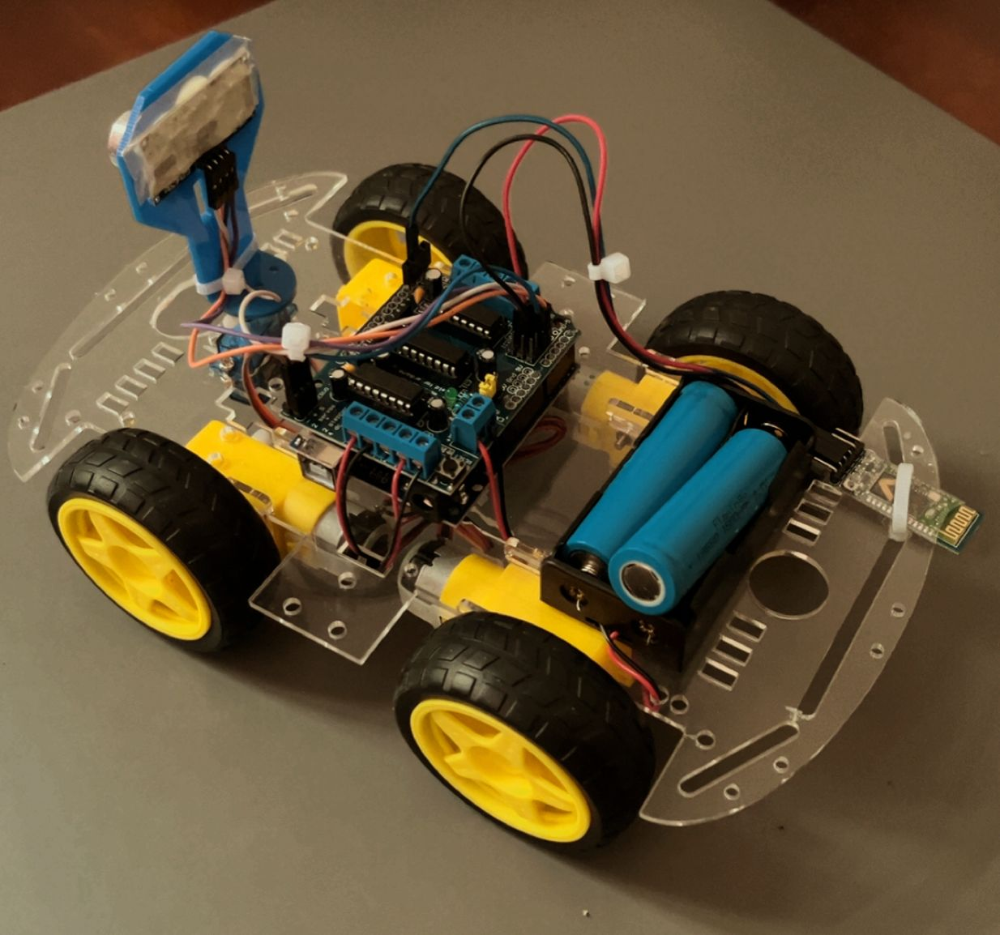

# Bluetooth and Obstacle-Avoiding Robot

This project features a robot built using Arduino that has the following capabilities:

- Manual control via Bluetooth
- Automatic obstacle avoidance

**Components:**

- Arduino UNO
- HC-05 Bluetooth module
- HC-SR04 ultrasonic sensor
- SG90 servo motor
- Motor driver
- Chassis with motors

**How It Works:**

The robot primarily responds to Bluetooth commands for manual control. However, when an obstacle comes within 20 cm, the robot automatically reroutes its path to avoid it.

**What app should you use:**

*After a lot of testing with different apps, I found out that the most effective app for this project is
["Arduino Bluetooth Controller"](https://play.google.com/store/apps/details?id=com.giristudio.hc05.bluetooth.arduino.control&hl=en-US)
By GiriStudio.*
